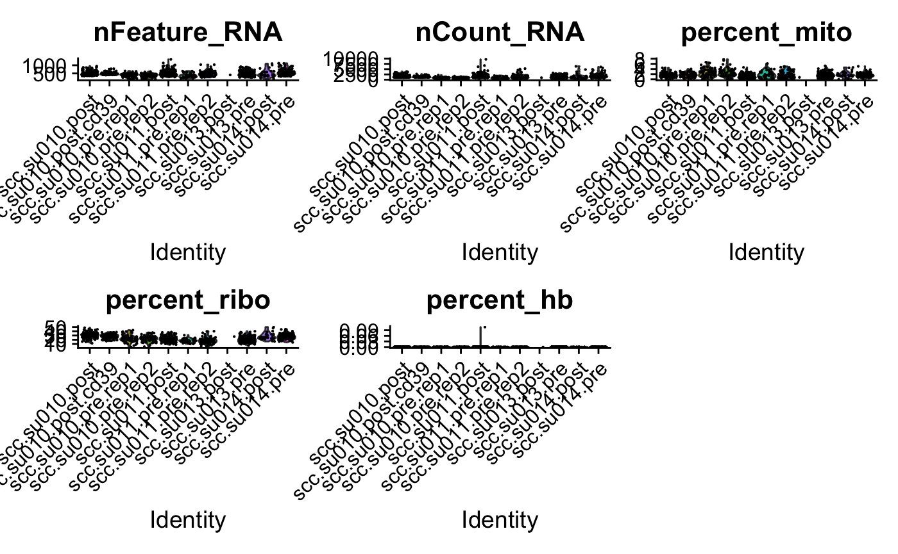
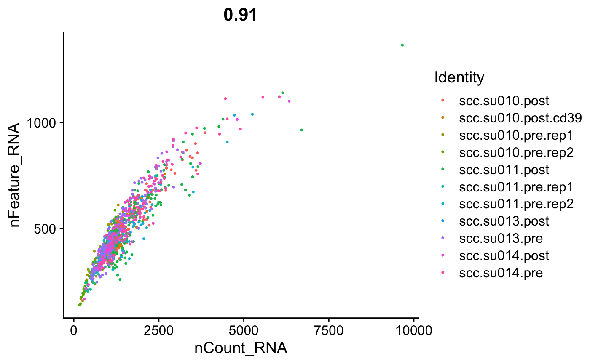
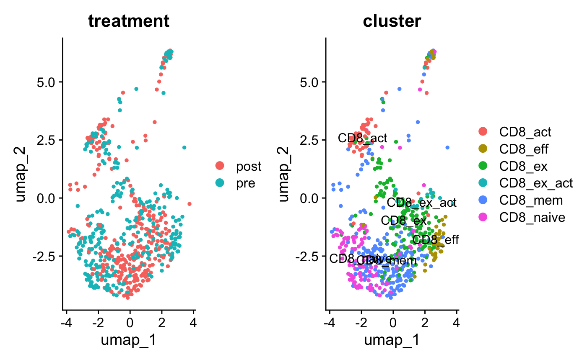
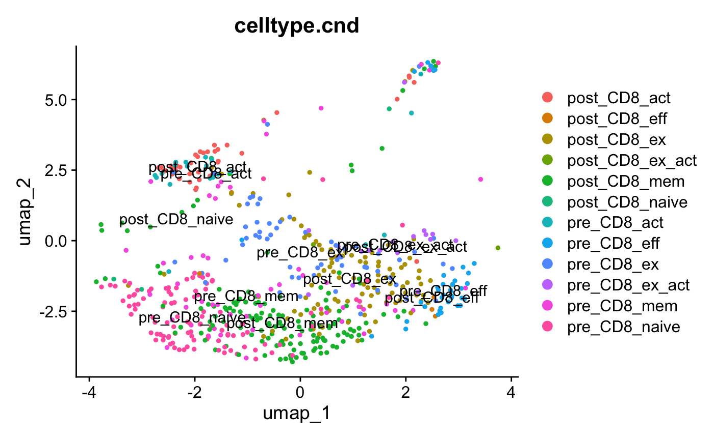

# Practices

#### 1. Import data

-   Import the files

First, we import the dates we need to use, in this case GSE123813_scc_metadata.txt.gz("<https://www.ncbi.nlm.nih.gov/geo/download/?acc=GSE123813&format=file&file=GSE123813%5Fscc%5Fmetadata%2Etxt%2Egz>") for metadata and the subsetscc for our subset.

\
For merging the two datasets into one cohesive unit for analysis, we rely on metadata. This metadata takes the form of a matrix that holds details regarding every individual cell ID. The cell ID acts as a singular reference point within our data; it points to specific elements within our metadata. For us, these elements will be patient types, details of treatment (including whether it's pre or post), and cluster types. Understanding clusters is vital towards our analysis of cell populations; cells will be organized into clusters according to common gene expression patterns, determined by their RNA sequences.

We will use the common cell ID in both datasets to establish connections between the two data sets. We create a matrix where the identifiers form the columns, and each row depicts a gene with unique occurrences counted. This paves way for distinguishing cellular subpopulations in future— some showing differential responses while others uniform —to pre and post-treatment in an identified manner.

To conduct a proper evaluation, two primary datasets must be brought together:

### 1. Metadata

This particular array furnishes elaborate particulars for every cell ID, entailing:

-   **Nature of patient**: It distinguishes the individual under whom the cell is registered.

-   **State of treatment**: Whether information was taken prior to or post a specific treatment.

-   **Type of cluster**: The group or cluster that the cell categorizes into based on gene expression patterns.

### 2. Data Concerning Gene Expression

This dataset includes the cell IDs and genes, as well as their frequency of expression within the cells.

### Incorporating the Datasets

#### Employ Cell ID as the Binding Factor

-   **Cell ID** acts as the unique identifier present in both the metadata and gene expression datasets.

-   This common element ensures a precise merge of the datasets.

There exists one key—and only one—common between metadata and gene expression: the cell ID. The presence of this unique identifier ensures a precise merge of the datasets.Steps to Integrate the Datasets

1.  **Use Cell ID as a Common Key**:

    -   The cell ID is the unique identifier that is present in both the metadata and the gene expression data.

    -   This common key allows us to merge the datasets accurately.

2.  **Create a Combined Matrix**:

    -   In the combined matrix, columns will represent various identifiers (like cell ID, patient type, treatment status, cluster type).

    -   Each row will represent a gene, and the cells in the matrix will contain the frequency of expression for each gene in each cell.

3.  **Analyze Gene Expression Across Clusters**:

    -   By counting the occurrences of each gene across different cells, we can determine patterns of gene expression within clusters.

    -   This helps in identifying subpopulations of cells with similar or different responses to treatments (pre vs. post).


```{r file}

scc_metadata <- read.delim("scc_metadata.txt")
subsetscc <- read.delim("subsetscc.csv" )

```

We need to check if we have the libraries in order to execute the scripts

```{r}
library(Seurat)
library(ggplot2)
library(tidyr)
library(dplyr)
```

#### 2. Data processing

-   Treat the data

-   Make sure metadata and subset data match

-   Create the Seurat Object

-   We add the important information that is the treatment and the cluster

In order to be able to organize and do the correct analysis, we look at our matrix and realize that the subsets we have are the genes of interest. In order to be able to do the analysis we need it to pass to the columns, so we use the function t() to be able to exchange it.


```{r}
t_subsetscc <- t(subsetscc) #if we see the metadata and the subset, the gens are int the diferent way, the colname and the other is in the row name, we do a transposition to have this informaton in the same line.

names_subset <- rownames(t_subsetscc) # we keep the rawnames
metadata_fil <- subset(scc_metadata, scc_metadata$cell.id %in% names_subset) # but we dont have the order rigth

names_o <- metadata_fil$cell.id
t_subsetscc_ord <- t_subsetscc[names_o, ]
all(rownames(t_subsetscc_ord)==metadata_fil$cell.id)# TRUE
```

In the next step we will create a Seurat object with the CreateSeuratObject() function where it will allow us to save the genes and the columns will have to be the classification field of this gene that interests us.

```{r}
Seurat_metadata <- CreateSeuratObject(counts=t(t_subsetscc_ord), project="GSE123813", meta.data = metadata_fil)

head(Seurat_metadata, n=5) # can we see if the Seurat its working

```


We want to put cluster and treatment inside our Seurat object. Since they are the characteristics that we are interested in observing

```{r}
Seurat_metadata$cluster <- metadata_fil$cluster
Seurat_metadata$treatment <- metadata_fil$treatment

table(Seurat_metadata$cluster)
table(Seurat_metadata$treatment)
```


#### 3. Quality control

-   Calculated and visualized various quality control.

-   Identified and visualized highly variable genes.

In the specific case of observing mitochondrial and ribosomal genes, this task is carried out because these genes are essential for proper cellular functioning.Dysfunctions in these genes may be indicative of cellular stress, given that both mitochondria and ribosomes play an essential role in vital processes such as energy production (in the case of mitochondria) and protein synthesis (in the case of ribosomes). By analyzing these percentages, one can understand the functional state of individual cells and how they might respond to stressful conditions.This facilitates more detailed investigation to better understand how different cell subpopulations react to specific stressful stimuli. - PercentageFeatureSet() = to calculate the percentage of the set of features of each cell, the ^MT-/^RP[SL]/\^HB[\^(P)] is a regular pattern that helps us choose the features that start with what we put in "" and since we will have to add a new one we will need add the name by calling the code col.name (name column), to later be able to call the expression percentage of the selected characteristic. - The VlnPlot() is a violin-style graph that shows the distribution of the expression in our different groups of cells. The group.by = is an r code that will ask us which style of how the graph will be divided. In this case, "orig.ident" is used, which tries to maintain the original identity of the cell as specified. features = feats specifies the genes that will be shown in the graphic, feats is a vector that contains numbers of the characteristics that are desired in the graphic. pt.size = 0.1 (point size), ncol = 3 (n=number, col=columns), NoLegend() (No legend) -\> that's all for how we will see the graphic visually, now we need to put the data we are using.


```{r}
Seurat_metadata <- PercentageFeatureSet(Seurat_metadata, "^MT-", col.name="percent_mito")
Seurat_metadata <- PercentageFeatureSet(Seurat_metadata, "^RP[SL]", col.name = "percent_ribo")
Seurat_metadata <- PercentageFeatureSet(Seurat_metadata, "^HB[^(P)]", col.name = "percent_hb")


feats <- c("nFeature_RNA", "nCount_RNA", "percent_mito", "percent_ribo", "percent_hb")


VlnPlot(Seurat_metadata, group.by = "orig.ident", features = feats, pt.size = 0.1, ncol = 3) +
    NoLegend() 


```



The "violin" graph shows us the density of cells with different levels of gene expression: the parts that are wider show us a greater density of cells with these levels of expression, while the narrower parts or patitas represent the opposite, which are less expressed. Each point is a cell.

```{r}
FeatureScatter(Seurat_metadata, "nCount_RNA", "nFeature_RNA", group.by = "orig.ident", pt.size = 0.5)
```



Each point in the scatter plot represents an individual cell, and its position is determined by its total RNA count on the X-axis and its total number of expressed genes on the Y-axis.

```{r}
CD4tots <- Seurat_metadata
CD8tots <- subset(Seurat_metadata, cluster %in% c("CD8_ex", "CD8_mem", "CD8_eff", "CD8_naive", "CD8_ex_act", "CD8_act"))

unique(Seurat_metadata@meta.data$cluster)

CD4tots <- CD8tots
CD4tots <- Seurat_metadata
CD4tots <- subset(CD4tots, subset=nFeature_RNA < 4000 & percent_mito < 8 )

table(CD4tots@meta.data$cluster)
```

#### 4.Normalization the data

-   Normalized the data

-   Identify the variables with different methods

-   PCA

Data normalization is a fundamental statistical step. So we treat them in the same way even if they come from different sources, and they can be in different measures. Normalization is important to eliminate or reduce unwanted effects that may arise due to technical or biological differences between samples.


```{r}
CD4tots <- NormalizeData(CD4tots)

CD4tots <- FindVariableFeatures(CD4tots, selection.method = "vst", nfeatures = 2000)#We select 2000 by default.

CD4tots <- ScaleData(CD4tots)
CD4tots <- RunPCA(CD4tots, npcs = 16) #We reduce dimensionality using RunPCA (We use number 16 as they use it in the experiment.)

CD4tots <- FindNeighbors(CD4tots, dims = 1:16)
CD4tots <- FindClusters(CD4tots, resolution = c(0.7))
CD4tots <- RunUMAP(CD4tots, dims=1:16)
```

#### 5. **Visualization of Clusters**

-   Using UMAP for the clusters.

-   Plotted clustered cells and annotated clusters.

In the next step, we specify a group of genes so that they behave differently between cells in the data we have provided. We have to identify which ones are more active in order to take them into account. We search for the genes that contribute most significantly to the variability of a gene expression matrix.


```{r}

DimPlot(CD4tots, reduction = "umap", group.by = "treatment")
#Let's create the plot to visualize the spatial distribution of annotated cells.
DimPlot(CD4tots, reduction="umap", group.by="cluster", label=T)

DimPlot(CD4tots, reduction = "umap", group.by = "RNA_snn_res.0.7", label = TRUE) # we do the cluster

```


*6.* S**ubset Analysis**

-   Created subsets based on cell identities.

-   Visualized subsets to compare treatment conditions.

In order to be able to focus, in the next step we have to specify the groups that are relevant for us, and we define them as clusters. This way we will be able to make a more visual limitation and in an effective way we will be able to analyze these specific groups.


```{r}


CD8tots <- subset(CD4tots, cluster %in% c("CD8_ex", "CD8_mem", "CD8_eff", "CD8_naive", "CD8_ex_act", "CD8_act"))

plot1 <- DimPlot(CD8tots, reduction = "umap", group.by="treatment")

plot2 <- DimPlot(CD8tots, reduction = "umap", group.by="cluster", label=T)


plot1 | plot2
```



We identify the new groups according to their treatment condition, that is, if they are 'pre' or 'post', separating them with an underscore.

```{r}
CD8tots$celltype.cnd <- paste0(CD8tots$treatment, "_", CD8tots$cluster)

DimPlot(CD8tots, reduction = "umap", group.by="celltype.cnd", label=T)

```



In this step, we're assigning cluster identities based on the definitions we've established earlier.

```{r}
Idents(CD8tots) <- CD8tots$celltype.cnd
```

#### *7. Cell proportions*

-   Calculated and visualized the proportions of different cell types based on treatment condition.

In order to be able to make the percentage of the data, it is necessary to make the proportion of groups with respect to the number of cells. So we will know how they are distributed.co


```{r}
prop.table(table(CD8tots@meta.data$celltype.cnd))*100

table(CD8tots@meta.data$celltype.cnd)


```

```{r}
CD8tots@meta.data$cluster_redefined <- CD8tots@meta.data$cluster
CD8totssubset <- CD8tots


CD8totssubsetpre <- subset(CD8totssubset, celltype.cnd %in% c("pre_CD8_act", "pre_CD8_eff", "pre_CD8_ex", "pre_CD8_ex_act", "pre_CD8_mem", "pre_CD8_Naive"))
CD8totssubsetpost <- subset(CD8totssubset, celltype.cnd %in% c("post_CD8_act", "post_CD8_eff", "post_CD8_ex", "post_CD8_ex_act", "post_CD8_mem", "post_CD8_Naive"))

```
